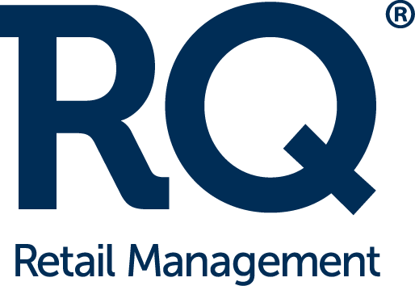
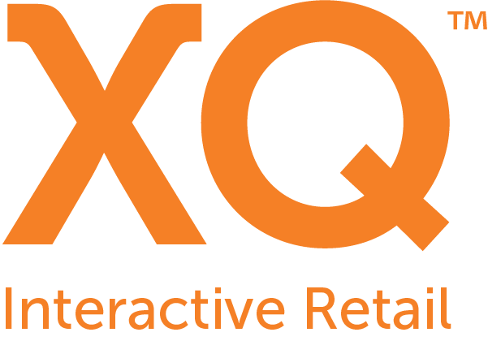



## Introduction to the iQmetrix API

### Welcome to the iQmetrix Developer Portal

This is where we invite third-party developers, partners and clients to learn more about development and integration opportunities via the iQmetrix Platform API.

All our Platform services are designed with a publicly-facing REST API as a first-class citizen. This is the same API that our own developers use to build various products

[Browse the documentation](/api/getting-started)

## Introduction to iQmetrix Platform

### What is the iQmetrix Platform?

The iQmetrix Platform is built from the ground up to support omnichannel retail experiences. Our development philosophy considers the operational complexity retailers face every day. Whether handling in-store, e-commerce or mobile transactions, we want to provide seamless experiences to retail staff and customers.

## Introduction to iQmetrix Products

**RQ Retail Management** is a modular system for managing all aspects of a store chain operation, including POS, ERP, inventory and HR. [Learn more](http://www.iqmetrix.com/products/rq)

**XQ Interactive Retail** brings elements of online and mobile shopping experiences into the physical store to engage and educate shoppers during the purchase process. [Learn more](http://www.iqmetrix.com/products/xq)

**iQmetrix Platform** allows users to effectively manage back-of-house operations and the in-store customer experience. In a nutshell, iQmetrix gives retailers what they need so customers can get what they want. [Learn more](http://www.iqmetrix.com/products/platform)

### Feedback

We are passionate about APIs and are committed to creating a great experience for you so please don't hesitate to [contact us](mailto:apidesign@iqmetrix.com) with any feedback related to API design and usability. 

### Support

Can't find what you're looking for or have any questions about our API?
Please contact our [API support team](mailto:apisupport@iqmetrix.com) and we will get back to you as fast as we possibly can.

### We're Hiring!

Interested in joining iQmetrix? Check out open positions at [iQmetrix.com](http://www.iqmetrix.com/careers)

### About iQmetrix

Learn more about our [company and our culture](http://www.iqmetrix.com/our-company)