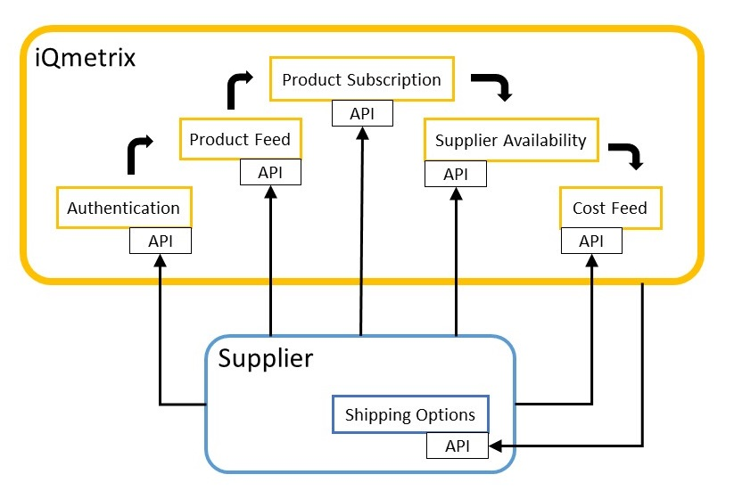
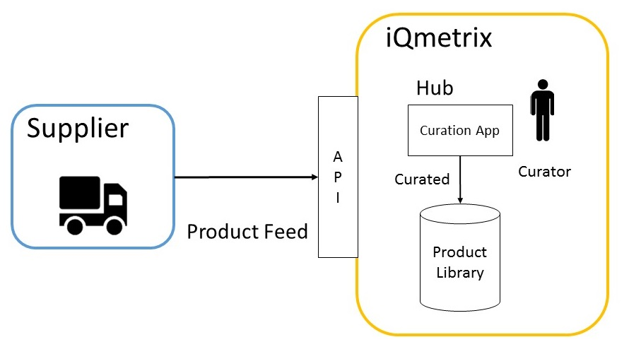
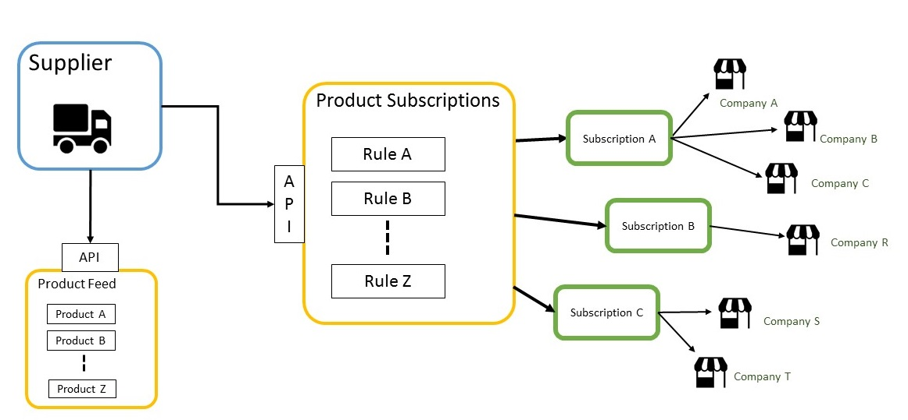




## Overview

The following document outlines the APIs and calls required for a dropship integration with iQmetrix. The steps outlined in this guide are focused on onboarding and are meant to be performed sequentially. 

Each segment in this guide will provide high-level concepts before describing examples of the JSON call required.

At a high-level the following topics will be covered in the guide:

* Authentication
* Product Feed
* Product Subscriptions
* Availability Feed
* Cost Feed
* Shipping Options

This guide is not intended to provide steps for ordering processing. For information on processing orders, please see [Sales Order Guide](/guides/creating-an-in-store-order/).

#### Audience

The intended audience for this guide are developers who have working level knowledge of JSON REST, but are not familiar with the iQmetrix API.

#### Prerequisites

To use this guide, the following steps must be completed:

* You must have your **onboarding package** from iQmetrix, which includes your access credentials and environments
* Your **Product Catalog**, physical inventory for your store(s), must be set up
* Your **Company Tree**, representing company structure (stores, groups, divisions, etc), must be created

{{tip}}
If the above steps are not complete or you are not sure, contact <a href="mailto:{{site.support_email}}?subject=Support">API Support</a>.
{{end}}

#### Environment

iQmetrix provides two environments for dropship partners: Demo and Production. Dropship partners will first gain access to the demo environment in order to test their environment with the iQmetrix API. 

The demo, or sandbox, environment is provided by iQmetrix as part of the onboarding package. The production environment must be requested once you have tested your API requests and verified the responses. For more information on environments, see {{environment}}.

The iQmetrix API supports JSON and JSON + HAL. See [Supported Response Formats](/api/getting-started) for more information.

#### Onboarding Package

As part of the onboarding process, you will have received an onboarding package from the iQmetrix API team. This package provides you credentials and access details in order to perform the topics covered in this guide. 

Should you require information beyond the scope of this guide, or did not receive the onboarding package, contact <a href ="mailto:{{site.support_email}}?subject=Support">API Support</a>.

The following items are provided in the onboarding package:

| Segment | Field | Example |
|:--------|:------|:--------|
| <strong>Authorization</strong> | Username | `user@supplier.net` |
|  | Password | `password123` |
|  | Client ID | `SUPPLIERDEMO` |
|  | Client Secret | `SECRET` |
| <strong>Product Feed</strong> | Feed ID | `34` |
|  | Classification Tree ID | `1` |
| <strong>Product Subscription</strong> | Subscribable List ID | `2c7dccd9-49ba-42ac-bffb-edcc08f40773` |
|  | Subscribable List Name | `Joe's Product List` |
|  | Entity (Supplier) ID | `60455` |
|  | Company IDs | `60454, 60900, 60901` |
| <strong>Availability Feed</strong> | Supplier ID | `60455` |
| <strong>Cost Feed</strong> | Supplier ID | `60455` |
|  | Company IDs | `60454, 60900, 60901` |

{{note}} The values will be different for each environment used, including authorization. {{end}}

## Step 1 - Authentication

In order to make authorized request to iQmetrix APIs, you need an {{access_token}}.

See the table below for different ways of getting an Access Token.

| If... | Then... |
|:------|:--------|
| You do not have an Access Token | See [Obtaining an Access Token](/api/authentication/#obtaining-an-access-token) |
| You have an Access Token, but it is close to expiring | See [Refreshing an Access Token](/api/authentication/#refreshing-an-access-token) |

The token is placed in the `Authorization` header of requests to iQmetrix APIs, prefixed by the word `Bearer`.

##### Example Request

    Authorization: Bearer (Access Token)

## Step 2 - Product Feed

A Product Feed allows you to channel all of your products and their specifications into a single source within the iQmetrix system. The product feed information you provide will be curated by iQmetrix and added into the Product Library, allowing companies to download product information into RQ. 

Suppliers that supply products for multiple industries (Classification Trees) and product types (Classifications) must have different product feeds. 

### Get Classification Tree by ID

iQmetrix organizes retail products in a hierarchal structure. At the top of this level is the Classification Tree, which is generally the industry. Below Classification Trees are Categories, which group similar products together, and Classifications which act as a template for Product information. 

Each Product must have an associated Classification Tree and Classification.

For more details on this concept, see {{classificationconcept}}.

To get a list of Classifications based on your provided Classification Tree ID, see [Get Classification Tree by ID](/api/classification-tree/#getting-a-classification-tree)

##### Example Request

    GET /ClassificationTrees(1)

### Get All Field Definitions

A field definition defines what Product specs are displayed to a customer, such as on a webpage. 

A field is an instance of a field definition. Products can have many fields, each with its own definition. 

See For more details on this concept, see [Field Definitions](/api/field-definitions).

To get all Field Definitions, see [Getting Field Definitions](/api/field-definitions/#getting-field-definitions)

##### Example Request

    GET /FieldDefinitions

### Add a Product

Now that you have a list of Field Definitions and Classifications, there are also optional parameters to enter for your Products. Ensure your products have at minimum a ModelName, as this will be used for curation in the iQmetrix platform.

We can now combine the information gathered from the previous steps to [Add a Product to your Product Feed](/api/product-feed/#add-product-to-product-feed)

<strong>Recommendations:</strong>

* Ensure your product images (assets) have a transparent background. We crop out any backgrounds so that we can create a clean reflection in XQ.
* Ensure dimensions are in separate fields, and not as a string, such as "5x5x5".

##### Example Request

    POST /v1/ProductFeeds(34)/Products 
    Authorization: Bearer (Access Token)
    Accept: application/json
    Content-Type: application/json

    {
        "Classification": {
            "TreeId": 1,
            "Id": 5
        },
        "Manufacturer": "Agent18",
        "ManufacturerSku": "980113579",
        "ModelName": "Agent18 SlimShield Case for iPhone 6",
        "UPC": "723755004337",
        "VendorSkus": [
            {
                "Sku": "1115884",
                "VendorName": "Amazon",
                "Description": "Online retailer"
            }
        ],
        "Fields": [
            {
                "Definition": {
                    "Id": 1,
                    "StringId": "Product Name"
                },
                "Value": "Agent18 SlimShield Case for iPhone 6 - Black"
            },
            {
                "Definition": {
                    "Id": 129,
                    "StringId": "Color Tags"
                },
                "Value": "Black"
            },
            {
                "Definition": {
                    "Id": 41,
                    "StringId": "Width",
                    "Unit": "inches"
                },
                "Value": "4"
            }
        ],
        "Assets": [
            {
                "AssetUrl": "http://image.sample.com/a.jpg"
            },
            {
                "AssetUrl": "http://image.sample.com/b.png"
            },
            {
                "AssetUrl": "http://image.sample.com/c.mov"
            }
        ]
    }

### Verify Results

Besides the JSON response from your API request, you can verify the products you entered into the product feed are ready for curation via [Get Product Feed by ID](/api/product-feed/#get-product-feed-by-id). 

##### Example Response

    HTTP 200  OK Content-Type application/json
    {
        "Id": 34,
        "Products": [
        ...
        ],
        "ProviderName": "Product Feed Name",
        "LastReceivedUpdatesFromProviderUtc": null,
        "Version": 8
    }

### Optional: Delete/Update a Product

Each Product entered into the Product Feed will have a corresponding ID from the response. 

To <strong>remove</strong> products from the product feed, you must delete them individually by providing their ProductId via [Delete Product from Product Feed](/api/product-feed/#delete-product-from-product-feed). 

To <strong>update</strong> products in the product feed, the products must be deleted first, then added again via [Add Product to Product Feed](/api/product-feed/#add-product-to-product-feed).

##### Example Request

    DELETE /v1/ProductFeeds(34)/Products(2)
    Authorization: Bearer (Access Token)
    Accept: application/json

## Step 3 - Product Subscriptions

Whilst the product feed provides iQmetrix with all the products and their content, the product subscription provides a subset of products that are available for dropship or other purposes.  The product subscription contains a list of SKUs and their selling price. Each retailer that is a part of the supplier's program will be subscribed to the product subscription. Once subscribed the retailer will have all of the products available to them in RQ, XQ and online, depending on the iQmetrix applications they have.

During synchronization, this feed updates all subscribed retailers with all products added or removed from the feed. This allows the supplier to control which products are available to consumers for dropship.  More than one feed may be provided by a supplier, which could serve different groups of retailers.

### Add Products

* EntityId = SupplierId 
* Name = List name
* ProductName = ModelName from Product Feed
* Vendor Sku = Product Sku
* Price = wholesale price
* Dropshippable = true

To add products to the product subscription, you must provide their ProductId via [Add Products to Subscribable List](/api/product-subscription/#put-products-in-subscribable-list). 

##### Example Request

    PUT /subscribablelists(2c7dccd9-49ba-42ac-bffb-edcc08f40773)
    Authorization: Bearer (Access Token)
    Accept: application/json
    Content-Type: application/json

    {
        "EntityId": 60455,
        "Name": "Joe's Product List",
        "Products": [
            {
                "ProductName": "Agent18 SlimShield Case for iPhone 6",
                "VendorSku": "1115884",
                "Price": 49.99,
                "Dropshippable": true
            }
        ]
    }

### Verify Results

You can verify the products entered into the subscribable list via [Get Subscribable List by ID](/api/product-subscription/#get-subscribable-list-by-id). 

##### Example Response

    HTTP 200 OK Content-Type: application/json
    {
        "ListId": "2c7dccd9-49ba-42ac-bffb-edcc08f40773",
        "Companies": [
            {
                "Id": 60454,
                "Name": "Company 1",
                "DateSubscribedUtc": "2015-10-01T18:46:25.774Z"
            },
            {
                "Id": 24165,
                "Name": "Test Partner Setup",
                "DateSubscribedUtc": "2015-01-15T18:23:02.167Z"
            },

            ...

        ]
    }

### Get Your Company IDs

For the remaining steps, you will need to know the Company IDs for the companies you will be interacting with. 

You can get a list of all your companies via the [Get All Companies for Product Subscription](/api/product-subscription/#get-all-companies-for-product-subscription) method.

##### Example Request
    
    GET /subscribablelists(2c7dccd9-49ba-42ac-bffb-edcc08f40773)
    Authorization: Bearer (Access Token)
    Accept: application/json

## Step 4 - Availability Feed

The availability feed provides iQmetrix with an updated cache of product availability.  This will allow iQmetrix to inform customers of the availability of a product.  Once a product is marked as unavailable by a supplier, iQmetrix will mark this product as out-of-stock to prevent future purchases in RQ.

### Change Availability

    POST /Suppliers({SupplierID})/Availability

### Verify Results

## Step 5 - Cost Feed

The cost feed allows you to provide wholesale costs for the various products you supply for your companies, based on the product’s Sku. The Sku must correspond with the Sku found in the Product Library. 

The cost feed provides iQmetrix with the wholesale cost (inclusive cost for the retailer) for each product.  This feed accepts costs per retailer, allowing suppliers to provide multiple costs per product.  These costs will be provided to the retailer during transaction and will be reflect in all reporting either in RQ or BI. 

<<insert diagram here>>

ERP

### Add Product Cost

Every Product must have an associated cost and a list of companies to apply the cost.

* Sku corresponds to the Vendor Sku you entered in the Product Feed and Subscription.
* Companies Ids = Company Ids from Product Subscription

You must add product costs to the cost feed via [Add Products to Cost Feed](/api/cost-feed/#add-a-product-to-cost-feed). 

##### Example Request

    POST /Suppliers(1324)/Cost
    Authorization: Bearer (Access Token)
    Accept: application/json
    Content-Type: application/json
    {
        "Products": [
            {
                "Sku": "1115884",
                "Cost": 20.99,
                "CompanyIds": [
                    60454,
                    24165,
                    13315
                ]    
            }
        ]
    }

### Verify Results 

The response body from the request notifies you that the information provided was accepted.

##### Example Response

    HTTP 202 Accepted Content-Type: application/json
    {
        "Id": "91a57ddb-2d42-402b-85b4-fe327a347313",
        "Products": [
            {
                "Sku": "1115884",
                "Cost": 20.99,
                "CompanyIds": [
                    60454,
                    24165,
                    13315
                ]
            }
        ]
    }

## Step 6 - Provide Shipping Options

A Shipping Options API provides iQmetrix with the ability to request shipping options for a specific address and set of products. The shipping options you provide will be displayed to the customer. Once the customer has selected their shipping option, the shipping option ID will be returned with the order during processing.

For this call, you will need to create an endpoint based on the specification provided by iQmetrix (see below).  You will also need to provide an endpoint URL for iQmetrix and credentials for authentication. 

The specification for the request must be in the format below:

##### Example Request

    POST /supplierapi/api/v1/ShippingOptions HTTP/1.1
    Host: supplier.azure-api.net
    Content-Type: application/json

    {
        "CompanyId": 123,
        "PostalCode": "V6B5Y1",
        "Items": [
            {
                  "ProductName": "Galaxy S6 Defender Case - Glacier",
                  "Quantity": 1,
                  "Sku": "9409OTSAGS6"
            }
        ]
    }

The specification of the response must be in the format below:

##### Example Response

    {
        "ShippingOptions": [
            {
            "Id": "350",
            "Name": "PurolatorExpress",
            "Cost": 7.94,
            "EstimatedTransitTime": "1",
            "Currency": "CAD"
            },
            {
                "Id": "352",
                "Name": "PurolatorGround",
                "Cost": 12.58,
                "EstimatedTransitTime": "1",
                "Currency": "CAD"
            },
            {
                "Id": "349",
                "Name": "PurolatorExpress10:30AM",
                "Cost": 20.31,
                "EstimatedTransitTime": "1",
                "Currency": "CAD"
           }
        ]
    }

## Step 7 - Request Production Account

Now that you have completed the basic steps for working with feeds in the iQmetrix API, you can start the integration process in a production environment. To request access to the iQmetrix production environment, please contact <a href ="mailto:{{site.support_email}}?subject=Support">API Support</a>.

They will then provide you with access credentials and authorization values for this environment. 

{{note}} These credentials are different from the demo environment. {{end}}
